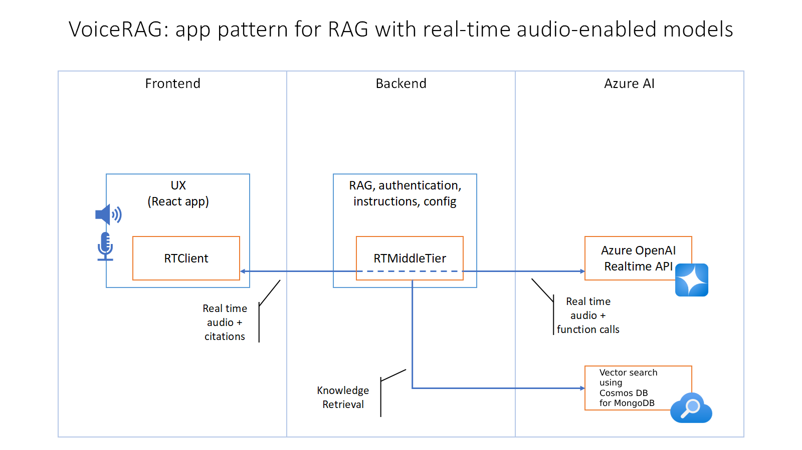
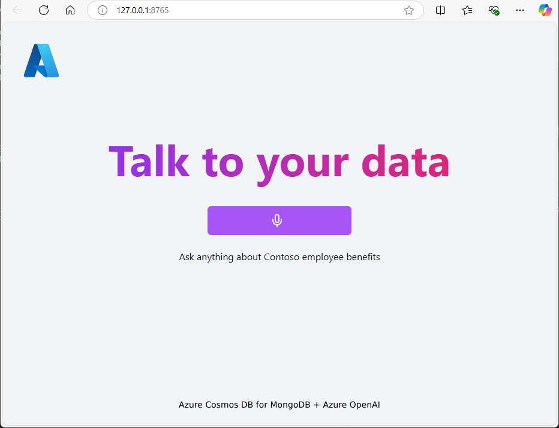

# VoiceRAG: An Application Pattern for RAG + Voice Using Azure Cosmos DB for MongoDB and GPT-4o Realtime API for Audio

[](https://github.com/codespaces/new?hide_repo_select=true&ref=main&skip_quickstart=true&machine=basicLinux32gb&repo=860141324&devcontainer_path=.devcontainer%2Fdevcontainer.json&geo=WestUs2)
[](https://vscode.dev/redirect?url=vscode://ms-vscode-remote.remote-containers/cloneInVolume?url=https://github.com/Azure-Samples/aisearch-openai-rag-audio)

This repository contains an example of how to implement **retrieval-augmented generation (RAG)** support in applications that use voice as their primary interface, powered by the **GPT-4o realtime API for audio**.

In this version, we are using **Azure Cosmos DB for MongoDB** as the storage for vector embeddings. The embeddings are generated using Azure OpenAI's `text-embedding-ada-002` model, which powers the retrieval of relevant documents during the RAG process.



## Running this Sample
We'll follow 4 steps to get this example running in your own environment: pre-requisites, creating the vector store, setting up the environment, and running the app.

### 1. Pre-requisites
You'll need instances of the following Azure services. You can re-use existing service instances or create new ones:
1. [Azure OpenAI](https://ms.portal.azure.com/#create/Microsoft.CognitiveServicesOpenAI), with 2 model deployments: one of the **gpt-4o-realtime-preview** model, and one for embeddings (e.g., `text-embedding-ada-002`).
2. [Azure Cosmos DB for MongoDB API](https://ms.portal.azure.com/#create/Microsoft.CosmosDBMongoAPI), which will store your document embeddings and metadata.

### 2. Setting up the vector store (Azure Cosmos DB for MongoDB)
In this application, the document embeddings will be stored in **Azure Cosmos DB for MongoDB**. We'll configure Cosmos DB to hold your knowledge base (e.g., documents or any other content you want the app to be able to retrieve) and their embeddings for vector search.

#### Storing documents in Azure Cosmos DB for MongoDB
1. **Create a MongoDB Collection**: Create a new database and collection in Azure Cosmos DB for MongoDB. This collection will store the documents and their vector embeddings.
2. **Upload documents**: You can upload your documents manually into the MongoDB collection, either through the Azure portal or using a MongoDB client like MongoDB Compass. These documents should include an embedding field for the vector representation (which will be generated automatically by the app).
3. **Embedding generation**: As documents are processed in the app, vector embeddings will be created using the `text-embedding-ada-002` model from Azure OpenAI. The embedding is a 1536-dimensional vector that allows for semantic search using cosine similarity.


### 3. Setting up the environment
The app needs to know which service endpoints to use for the Azure OpenAI and Azure Cosmos DB for MongoDB services. The following variables can be set as environment variables, or you can create a `.env` file in the root directory with this content:

   ```
   AZURE_OPENAI_ENDPOINT=wss://<your instance name>.openai.azure.com
   AZURE_OPENAI_DEPLOYMENT=gpt-4o-realtime-preview
   AZURE_OPENAI_API_KEY=<your api key>
   MONGO_CONNECTION_STRING=<your mongo connection string>
   MONGO_DB_NAME=<your database name>
   MONGO_COLLECTION_NAME=<your collection name>
   ```

   - `AZURE_OPENAI_ENDPOINT`: The WebSocket endpoint for Azure OpenAI's GPT-4o realtime API.
   - `AZURE_OPENAI_DEPLOYMENT`: The deployment name for the GPT-4o model.
   - `AZURE_OPENAI_API_KEY`: Your API key for Azure OpenAI.
   - `MONGO_CONNECTION_STRING`: The connection string for Azure Cosmos DB for MongoDB API.
   - `MONGO_DB_NAME`: The name of the database you created for storing embeddings.
   - `MONGO_COLLECTION_NAME`: The name of the collection where documents and embeddings are stored.

### 4. Running the app

Once the codespace opens (this may take several minutes), open a new terminal.

#### VS Code Dev Containers
You can run the project in your local VS Code Dev Container using the [Dev Containers extension](https://marketplace.visualstudio.com/items?itemName=ms-vscode-remote.remote-containers):

1. Start Docker Desktop (install it if not already installed).
2. Open the project:

    [](https://vscode.dev/redirect?url=vscode://ms-vscode-remote.remote-containers/cloneInVolume?url=https://github.com/azure-samples/aisearch-openai-rag-audio)
3. In the VS Code window that opens, once the project files show up (this may take several minutes), open a new terminal.

#### Local environment
1. Install the required tools:
   - [Node.js](https://nodejs.org/en)
   - [Python >=3.11](https://www.python.org/downloads/)
      - **Important**: Python and the pip package manager must be in the path in Windows for the setup scripts to work.
      - **Important**: Ensure you can run `python --version` from the console. On Ubuntu, you might need to run `sudo apt install python-is-python3` to link `python` to `python3`.
   - [Powershell](https://learn.microsoft.com/powershell/scripting/install/installing-powershell)

2. Clone the repo:
   ```bash
   git clone https://github.com/Azure-Samples/cosmosdb-openai-rag-audio
   ```
3. Create a Python virtual environment and activate it:
   ```bash
   python -m venv .venv
   source .venv/bin/activate  # On Windows: .venv\Scripts\Activate.ps1
   ```
4. Run this command to start the app:

   Windows:
   ```pwsh
   cd app
   pwsh .\start.ps1
   ```

   Linux/Mac:
   ```bash
   cd app
   ./start.sh
   ```

6. The app is available on http://localhost:8765

Once the app is running, when you navigate to the URL above you should see the start screen of the app:


### Frontend: Enabling Direct Communication with AOAI Realtime API
You can make the frontend skip the middle tier and talk to the WebSockets AOAI Realtime API directly, if you choose to do so. However, note that this will stop the retrieval-augmented generation (RAG) process, and will require exposing your API key in the frontend, which is insecure. **DO NOT use this in production**.

Pass some extra parameters to the `useRealtime` hook:
```typescript
const { startSession, addUserAudio, inputAudioBufferClear } = useRealTime({
    useDirectAoaiApi: true,
    aoaiEndpointOverride: "wss://<NAME>.openai.azure.com",
    aoaiApiKeyOverride: "<YOUR API KEY, INSECURE!!!>",
    aoaiModelOverride: "g

pt-4o-realtime-preview",
    ...
});
```

### Notes

>Sample data: The PDF documents used in this demo contain information generated using a language model (Azure OpenAI Service). The information contained in these documents is only for demonstration purposes and does not reflect the opinions or beliefs of Microsoft. Microsoft makes no representations or warranties of any kind, express or implied, about the completeness, accuracy, reliability, suitability, or availability with respect to the information contained in this document. All rights reserved to Microsoft.
